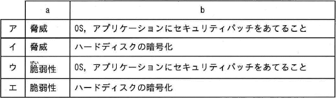

1. キーボードやマウスは、コンピュータの５大装置のどれに分類されますか．
	1. 入力装置 *
	1. 演算装置
	1. 制御装置
	1. 出力装置

1. 企業のサーバーに用いられる、大型のコンピュータはどれですか．
	1. スマートフォン
	1. ノートPC
	1. デスクトップPC
	1. ラックマウントPC *

1. Webブラウザは、次のうちどれに該当しますか．
	1. システムソフトウェア
	1. デバイスドライバー
	1. OS
	1. アプリケーション *

1. 以下にうち、システムソフトウェアに含まれないものはどれですか．
	1. ミドルウェア
	1. OS
	1. アプリケーション *
	1. デバイスドライバー

1. サーバーはどこに設置するのが最適ですか。
	1. 事務所の誰でも利用出来る場所
	1. 屋外
	1. 専用の部屋 *
	1. 自宅

1. 省電力に優れたサ一バ一は次のうちどれですか。
	1. デスクトップPC
	1. ワークステーション
	1. ブレード型サ一バー *
	1. タワー型サーバー

1. サーバールームで節電できるのはどの方法ですか。
	1. UPSを発電機に交換する
	1. 室温を低く設定する
	1. 冷気の漏れを防ぐため、できる限り密封する *
	1. 冷却ファンを増設する

1. クラウドコンピューティングを正しく説明しているものはどれですか。
	1. リソースをインターネット上で提供する *
	1. 1つのサ一バー上でアプリケーションを処理する
	1. 1つのサーバー上で複数のシステムを動作させる
	1. コンピュータが複数のCPUを利用する

1. コンピュータにビデオカードを追加する際に、十分な電力が供給されるかどうかを確認するのはどれですか．
	1. GPU
	1. CPU
	1. NIC
	1. PSU *

1. 一時的なプログラムやデータの記憶に使用され、コンピュータの電源を切るとデータが保持されないのはどれですか．
	1. CPU
	1. メインメモリ *
	1. SATA
	1. SSD

1. 大容量のデータの保存に使用され、コンピュータの電源を切ってもデータが保持されるのはどれですか．
	1. RAM
	1. ハードディスク *
	1. プロセッサ
	1. PSU

1. DIMMとS.O.DIMMとの違いで正しいものはどれですか。
	1. S.O.DIMMはデスクトツプで、DIMMはノー卜パソコンで利用される
	1. S.O.DIMMの方が高速である
	1. S.O.DIMMはDIMMよりサイズが小さい *
	1. S.O.DIMMはDIMMよりサイズが大きい

1. 一般的にノ一卜PCに搭載されるメモリはどれですか。
	1. SIMM
	1. DIMM
	1. S.O.DIMM *
	1. EDO RAM

1. 次の中で一番ケーブルが細いのはどれですか。
	1. SATA *
	1. IDE
	1. SCSI
	1. FD

1. 次の中で周辺機器を接続するのに利用される無線技術はどれですか。
	1. 802.11b
	1. RF
	1. IrDA
	1. Bluetooth *

1. サ-バ-ル-厶の構造で、環境に配慮している事はどれですか。
	1. なるべく換気をしない
	1. なるべく冷気が漏れないようにする *
	1. なるべく湿度を高く保つ
	1. なるベぐ騒音が漏れないようにする

1. OSの起動ディスクとして最も高速なのはどれですか．
	1. ハードディスク *
	1. DVD
	1. CD
	1. SSD

1. ディスプレイに表示されるウィンドウが大きすぎる場合に技術者が調整すべきものは、次のうちどれですか．
	1. コントラスト
	1. 向き
	1. 明度
	1. 解像度 *

1. 熱を利用して特別な用紙に印字するプリンターはどれですか
	1. レーザー
	1. サーマル *
	1. インクジェット
	1. ターミナル

1. ネットワークを介して複数のコンピューターで共有されるファイルサーバー専用機はどれですか
	1. ネットワークアタッチドストレージ *
	1. USBメモリ
	1. メモリカード
	1. マルチカードリーダー

1. ディスプレイやプロジェクター接続に広く用いられる15ピンのアナログインターフェースはどれですか．
	1. VGA *
	1. DVI
	1. HDMI
	1. S-Video

1. モバイル向けOSの特徴は、次のうちどれですか．
	1. 商用使用である
	1. ソースコードを公開している
	1. 無料で使用できる
	1. 軽量である *

1. インターネットアクセスが許可され、パスワードの作成ができないユーザーアカウントはどれですか．
	1. Guest *
	1. 標準ユーザー
	1. 管理者
	1. Power User

1. ファイルやフォルダーのデータの保存容量を少なくするには、どうしますか．
	1. 移動
	1. コピー
	1. 圧縮 *
	1. 削除

1. OSを自動更新する設定のメリットは、次のうちどれですか．
	1. 正常にハードディスクにファイルを配置できる
	1. 消失や消去したファイルを復元できる
	1. OSの問題の修正やセキュリティ強化を迅速に行うことができる *
	1. 最新のウイルス定義ファイルをインストールできる

1. 最も信頼性の高いデータ接続技術は、次のうちどれですか．
	1. イーサネット *
	1. Bluetooth
	1. 無線LAN
	1. 携帯通信サービス

1. 最新かつ最強の無線LANセキュリティ規格はどれですか．
	1. WEP
	1. WPA
	1. WPA2 *
	1. SSID

1. インターネット接続を暗号化し、安全なオンラインバイキングを実現するのはどれですか．
	1. HTTP
	1. HTTPS *
	1. SFTP
	1. FTPS

1. ローカルストレージと比較したクラウドストレージのメリットはどれですか．
	1. 通信費用の減少
	1. ファイルへのアクセス速度の向上
	1. リソースの柔軟な増減が可能 *
	1. セキュリティが高い

1. ブラウザとWebサーバ間の通信プロトコルを，HTTPからHTTPSに変更した。これによって実現できることとして，適切なものはどれか。
	1. クライアントPCとWebサーバ間の通信速度の向上
	1. コンピュータウイルス感染の防止
	1. 通信の機密性の確保 *
	1. ブラウザの表示速度の向上

1. サブネットマスクの役割として，適切なものはどれか。
	1. IPアドレスからEthernet上のMACアドレスを割り出す。
	1. IPアドレスに含まれるネットワークアドレスと，そのネットワークに属する個々のコンピユータのホストアドレスを区分する。 *
	1. インターネットと内部ネットワークを中継するときのグローバルIPアドレスとプライベートIPアドレスを対応付ける。
	1. 通信相手先のドメイン名とIPアドレスを対応付ける。

1. 機械的な可動部分が無く，電力消費も少ないという特徴をもつ補助記憶装置はどれか。
	1. CD-RWドライブ
	1. DVDドライブ
	1. HDD
	1. SSD *

1. 無線LANのアクセスポイントに備わるセキュリティ対策のうち，自身のESSIDの発信を停止するものはどれか。
	1. MACアドレスフィルタリング
	1. WEP
	1. WPA
	1. ステルス機能 *

1. 認証方式を"知識による認証"，"所持品による認証"及び"個人の身体的・行動的特徴による認証"の三つに分類したとき，"個人の身体的・行動的特徴による認証"に分類されるものはどれか。
	1. IDカードによる認証
	1. ニーモニック認証
	1. バイオメトリクス認証 *
	1. パスワード認証

1. 情報セキュリティにおけるソーシャルエンジニアリングへの対策の例として，適切なものはどれか。
	1. ウイルスを検知，除去する機能を電子メールシステムに導入する。
	1. サーバへの攻撃を想定した擬似アタック試験を実施し，発見された脆(ぜい)弱性への対策を行う。
	1. 従業員のセキュリティ意識を高めるため，セキュリティ教育を行う。 *
	1. 停電に備えて，サーバルーム向けの自家発電装置を導入する。

1. ランサムウェアに関する記述として，適切なものはどれか。
	1. PCやファイルを使用不能にするなどして，回復のための金銭を要求する。 *
	1. コンピュータの画面へ自動的に広告を表示する。
	1. 利用者がキーボードから入力した情報を記録し，外部に送信する。
	1. ワープ口ソフトや表計算ソフトの文書ファイルに感染する。

1. 電子メールに関するプロトコルの説明のうち，適切な記述はどれか。
	1. IMAP4によって，画像のようなバイナリデータをASCII文字列に変換して，電子メールで送ることができる。
	1. POP3によって，PCから電子メールを送信することができる。
	1. POP3やIMAP4によって，メールサーバから電子メールを受信することができる。 *
	1. SMTPによって，電子メールを暗号化することができる。

1. フィッシングの説明として，適切なものはどれか。
	1. ウイルスに感染しているPCへ攻撃者がネットワークを利用して指令を送り，不正なプログラムを実行させること
	1. 金融機関などからの電子メールを装い，偽サイトに誘導して暗証番号やクレジツトカード番号などを不正に取得すること *
	1. パスワードに使われそうな文字列を網羅した辞書のデータを使用してパスワードを割り出すこと
	1. 複数のコンピュータから攻撃対象のサーバへ大量のパケットを送信し，サーバの機能を停止させること

1. インターネット閲覧時に、システムを無効にすることを避けるために支払いを要求する脅迫メッセージが表示されました．このタイプのマルウェアは、次のうちどれですか
	1. ランサムウェア *
	1. アドウェア
	1. スパイウェア
	1. ウイルス

1. 他要素認証の例として適切なものは、次のうちどれですか．
	1. ユーザー名とパスワード、PIN
	1. ユーザ名とパスワード、ICカード *
	1. ユーザー名とパスワード、誕生日
	1. ユーザー名とパスワード

1. ブラウザを開くと、知らないWebサイトへ転送されました．この問題の原因は、次のうちどれですか．
	1. アドウェアの影響 *
	1. セキュリティポリシーの影響
	1. ブラウザキャッシュの影響
	1. ソーシャル・エンジニアリングの影響

1. コンピューターの利用を開始する際に、ハードウェアが期待通りに動かない場合は、まず何を確認しますか．
	1. ケーブルや接続部が外れていないか *
	1. アンチウイルスソフトがインストールされているか
	1. OSがインストールされているか
	1. インターネットに接続できるか

1. クラウドベースストレージの特徴は、次のうちどれですか．
	1. データを毎日コピーする
	1. データをローカルにコピーする
	1. データを事業者サイトに保管する *
	1. データをすべてバックアップする

1. 盗難時にモバイルデバイスへの不正アクセスを防止する方法は、次のうちどれですか．
	1. 機内モードの有効化
	1. 同期の無効化
	1. パスワードロック *
	1. GPSトラッキング

1. 電気電子機器において特定有害物質の使用制限を定めているガイドライは、次のうちどれですか．
	1. RoHS *
	1. EMI
	1. ESD
	1. エネルギースター

1. Webサイトによっては，ブラウザで閲覧したときの情報を，ブラウザを介して閲覧者のPCに保存することがある。以後このWebサイトにアクセスした際は保存された情報を使い，閲覧の利便性を高めることができる。このような目的で利用される仕組みはどれか。
	1. Cookie *
	1. SQL
	1. URL
	1. XML

1. PCに接続された周辺装置と，OSやアプリケーションソフトとを仲介して，周辺装置を制御・操作するソフトウェアはどれか。
	1. アーカイバ
	1. インストーラ
	1. デバイスドライバ *
	1. ミドルウェア

1. 情報セキュリティにおけるソーシャルエンジニアリングの例として，適切なものはどれか。
	1.社員を装った電話を社外からかけて，社内の機密情報を聞き出す。 *
	1. 送信元IPアドレスを偽装したパケットを送り，アクセス制限をすり抜ける。
	1. ネットワーク上のパケットを盗聴し，パスワードなどを不正に入手する。
	1. 利用者が実行すると，不正な動作をするソフトウェアをダウンロードする。

1. 感光ドラム上に印刷イメージを作り，粉末インク(トナ一)を付着させて紙に転写，定着させる方式のプリンタはどれか。
	1. インクジェットプリンタ
	1. インパクトプリンタ
	1. 熱転写プリンタ
	1. レーザプリンタ *

1. 毎週日曜日の業務終了後にフルバックアップファイルを取得し，月曜日～土曜日の業務終了後には増分バックアップファイルを取得しているシステムがある。水曜日の業務中に故障が発生したので，バックアップファイルを使って火曜日の業務終了時点の状態にデータを復元することにした。データ復元に必要なバックアップファイルを全て挙げたものはどれか。ここで，増分バックアップファイルとは，前回のバックアップファイル(フルバックアップファイル又は増分バックアップファイル)の取得以降に変更されたデータだけのバックアップファイルを意味する。
	1. 日曜日のフルバックアップファイル，月曜日と火曜日の増分バックアップファル *
	1. 日曜日のフルバックアップファイル，火曜日の増分バックアップファイル
	1. 月曜日と火曜日の増分バックアップファイル
	1. 火曜日の増分バックアップファイル

1. シングルサインオンの説明として，適切なものはどれか。
	1. あるPCからサーバにログインしている間は，他のPCから同じユーザIDでログインできないようにする仕組み
	1. 最初に認証に成功すると，その後は許可された複数のサービスに対して，利用者が都度認証の手続をしなくとも利用できるようにする仕組み *
	1. 利用者が認証局(CA)から発行された電子証明書を一度PCに登録しておけば，PCへのログインの際に電子証明書によって本人認証をする仕組み
	1. 利用者が認証の際に使用するパスワードに，一度しか使えない使い捨てのパスワードを使うことで，不正アクセスを防止する仕組み

1. 拡張子"avi"が付くファイルが扱う対象として，最も適切なものはどれか。
	1. 音声
	1. 静止画
	1. 動画 *
	1. 文書

1. インタフェースの規格(1)～(4)のうち，接続ケーブルなどによる物理的な接続を必要としない規格だけを全て挙げたものはどれか。  
(1) Bluetooth  
(2) IEEE 1394  
(3) IrDA  
(4) USB 3.0  
	1. (1), (2)
	1. (1), (3) *
	1. (2), (3)
	1. (3), (4)

1. 自社で利用する購買システムの導入に当たり，外部サービスであるSaaSを利用した事例はどれか。
	1. サービス事業者から提供される購買業務アプリケーションのうち，自社で利用したい機能だけをインターネット経由で利用する。 *
	1. サービス事業者から提供されるサーバ，OS及び汎用データベースの機能を利用して，自社の購買システムを構築し，インターネット経由で利用する。
	1. サービス事業者から提供されるサーバ上に，自社の購買システムを構築し，インターネット経由で利用する。
	1. 自社の購買システムが稼働する自社のサーバをサービス事業者の施設に設置して，インターネット経由で利用する。

1. ディジタルコンテンツで使用されるDRM(Digital Rights Management)の説明として，適切なものはどれか。
	1. 映像と音声データの圧縮方式のことで，再生品質に応じた複数の規格がある。
	1. コンテンツの著作権を保護し，利用や複製を制限する技術の総称である。 *
	1. ディジタルテレビでデータ放送を制御するXMLベースの記述言語である。
	1. 臨場感ある音響効果を再現するための規格である。

1. ホットプラグの説明として，適切なものはどれか。
	1. PCの電源を入れたままで周辺機器の着脱が行える機能のこと *
	1. アプリケーションソフトの機能を強化するために，後から組み込むソフトウェアのこと
	1. 周辺機器との接続ケーブルを介して，PCから周辺機器に電力を供給する仕組みのこと
	1. 特定のプログラムを実行して，処理に掛かる時間でシステムの性能を評価する手法のこと

1. 情報セキュリティの対策を，技術的セキュリティ対策，人的セキュリティ対策及び物理的セキュリティ対策の三つに分類するとき，物理的セキュリティ対策に該当するものはどれか。
	1. 従業員と守秘義務契約を結ぶ。
	1. 電子メール送信時にディジタル署名を付与する。
	1. ノートPCを保管するときに施錠管理する。 *
	1. パスワードの変更を定期的に促す。

1. 無線LANのセキュリティを向上させるための対策はどれか。
	1. ESSIDをステルス化する。 *
	1. アクセスポイントへの電源供給はLANケーブルを介して行う。
	1. 通信の暗号化方式をWPA2からWEPに変更する
	1. ローミングを行う。

1. Webサイトの更新状況を把握するために使われる情報の形式はどれか。
	1. CSS
	1. DHCP
	1. ISMS
	1. RSS *

1. CPUのクロック周波数に関する記述のうち，適切なものはどれか。
	1. 32ビットCPUでも64ビットCPUでも，クロック周波数が同じであれば同等の性能をもつ。
	1. 同一種類のCPUであれば，クロック周波数を上げるほどCPU発熱量も増加するので，放熱処置が重要となる。 *
	1. ネットワークに接続しているとき，クロック周波数とネットワークの転送速度は正比例の関係にある。
	1. マルチコアプロセッサでは，処理能力はクロック周波数には依存しない。

1. OSS(Open Source Software)に関する記述のうち，適切なものはどれか。
	1. ソースコードは，一般利用者に開示されていない。
	1. ソースコードを再配布してはいけない。
	1. ソフトウェアのセキュリティは，開発者によって保証されている。
	1. 著作権は放棄されていない。 *

1. スマートフォンを安全に利用するために行うこととして，適切なものはどれか。
	1. OSはアップデートせず，購入時の状態のままで利用する。
	1. 権限昇格などの改造を行い，機能を強化する。
	1. パスワードによる画面のロック機能を設定する。 *
	1. 有用と思うアプリケーションであれば，どのようなWebサイトからダウンロードしてもよい。

1. コンピュータウイルスに関する次の記述中のa，bに入れる字句の適切な組合せはどれか。  
OSやアプリケーションの(a)を突くようなウイルスの感染予防には，ウイルス定義ファイルを最新の状態に保つことや(b)が必要である。

	1. ア
	2. イ
	3. ウ *
	4. エ

1. あるネットワークに属するPCが，別のネットワークに属するサーバにデータを送信するとき，経路情報が必要である。PCが送信相手のサーバに対する特定の経路情報をもっていないときの送信先として，ある機器のIPアドレスを設定しておく。この機器の役割を何と呼ぶか。
	1. デフォルトゲートウェイ *
	1. ネットワークインタフェースカード
	1. ハブ
	1. ファイアウォール

1. 建物の中など，限定された範囲内を対象に構築する通信ネットワークはどれか。
	1. IP-VPN
	1. LAN *
	1. WAN
	1. 広域イーサネット

1. 互換CPUに関する記述のうち，最も適切なものはどれか。
	1. オリジナルのCPUで動作するのと同じOSやアプリケーションソフトを動作させることができる。 *
	1. オリジナルのCPUの特許が有効な期間は，開発・製造することはできない。
	1. シングルコアCPUに対応する互換CPUは開発されているが，マルチコアCPUに対応する互換CPUは存在しない。
	1. 古くなったPCの性能を向上させるために用いられるCPUであり，新製品のPCに採用されることはない。

1. PCの処理効率を高めるために，CPUが主記憶にアクセスする時間を見かけ上短縮することを目的としたものはどれか。
	1. SSD
	1. 仮想記憶
	1. キャッシュメモリ *
	1. デフラグ

1. ブラウザとWebサーバ間でSSLを使った通信を行うことを示すURLの先頭の記述として，適切なものはどれか。
	1. http://
	1. https:// *
	1. shttp://
	1. ssl://

1. テザリングの説明として，適切なものはどれか。
	1. 自己複製し，ネットワークなどを経由して感染を拡大するウイルスの一種
	1. スマートフォンなどの通信端末をモバイルルータのように利用して，PCなどをインターネットに接続する機能 *
	1. 電子データに対し，ハッシュ関数と公開鍵暗号を用いることで，改ざんを検知する方式
	1. ホームページの入力フィールドにSQLコマンドを意図的に入力することで，データベース内部の情報を不正に操作する攻撃

1. スパイウェアが目的としている動作の説明として，最も適切なものはどれか。
	1. OSやソフトウェアの動作を不安定にする。
	1. ファイルシステム上から勝手にファイルを削除する。
	1. ブラウザをハイジャックして特定の動作を強制する。
	1. 利用者に気付かれないように個人情報などを収集する。 *

1. PCをネットワークに接続せずに単独で利用する形態を何と呼ぶか。
	1. シンクライアント
	1. シングルプロセッサ
	1. スタンドアロン *
	1. ピアツーピア

1. PCにおける有害なソフトウェアへの情報セキュリティ対策として，適切なものはどれか。
	1. 64ビットOSを使用する。
	1. ウイルス定義ファイルは常に最新に保つ。 *
	1. 定期的にハードディスクをデフラグする。
	1. ファイルは圧縮して保存する。

1. ソーシャルエンジニアリングによる被害に結びつきやすい状況はどれか。
	1. 運用担当者のセキュリティ意識が低い。 *
	1. サーバ室の天井の防水対策が行われていない。
	1. サーバへのアクセス制御が行われていない。
	1. 通信経路が暗号化されていない。

1. 隣の部屋に他社が引っ越してきた頃から，自社の無線LANの通信速度が低下した。原因を調査して，自社の無線LANの設定を変更することで，元の通信速度に戻った。このときに変更した内容として，適切なものはどれか。ここで，自社のESSIDは，その引っ越してきた他社のものとは異なる文字列である。
	1. 暗号化のキー文字列を変更した。
	1. 暗号化の設定をWEPからWPA2に変更した。
	1. ステルス機能を設定した。
	1. 無線チャネルを変更した。 *

1. 無線LANにおいて，端末とアクセスポイント間で伝送されているデータの盗聴を防止するために利用されるものはどれか。
	1. ANY接続拒否
	1. ESSIDステルス
	1. MACアドレスフィルタリング
	1. WPA2 *